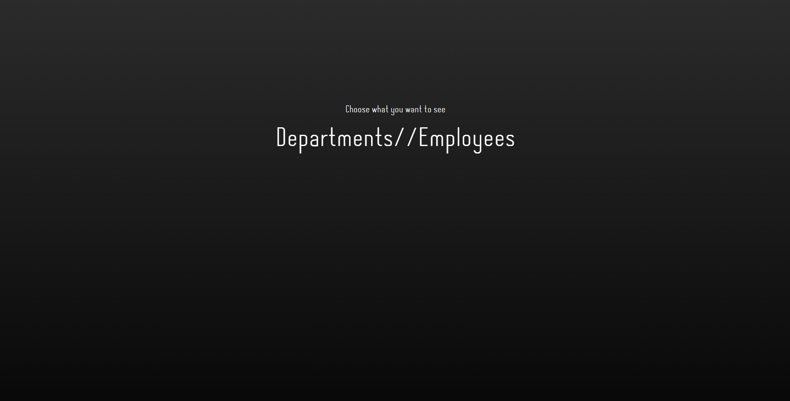

# Department App 

### Vision

"Department" App is a web application which allows users to record information about departments and employees.

Application should provide:

- Storing departments and employees in database
- Display list of departments
- Updating the list of departments (adding, editing, removing)
- Searching departments by name
- Searching departments with average salary in specified range
- Searching departments amount of employees in specified period
- Display list of employees
- Updating the list of employees (adding, editing, removing)
- Searching employees by name, department
- Searching employees with salary in specified range
- Searching employees born in specified period

### 1. Departments

#### 1.1 Display list of departments

The mode is designed for viewing the list of departments.

***Main scenario:***

- User selects *"Departments"* at main page

- Application displays list of departments (Pic. 1.1)

Pic. 1.1 List of departments

The list displays the following columns:

- Name - name of the department
- Average salary - average salary across all the employees that works in the department

***Searching:***

- User enters search data and clicks on the *"Search"* button
- Application displays updated list of departments based on provided data

#### 1.2 Create department

***Main scenario:***

- User clicks the *"Create"* button in the departments view mode
- Application redirects user to the department creation page
- User enters data and presses the *"Create"* button
- If entered data is valid, the record is added to the database and message indicating success is displayed
- If error occurs, then error message is displayed

***Cancel operation scenario:***

- User clicks the *"Create"* button in the departments view mode
- Application redirects user to the department creation page
- User enters data and presses the *"Return"* button
- Data don’t save in database; list of departments is displaying to user.

Pic. 1.2 Adding a department

When adding a department the following details are entered:

- Department name - name of the department

Constraints for data validation:

- Department name must be unique and minlength > 1

#### 1.3 Display department

The mode is designed for viewing a particular department.

***Main scenario:***

- User clicks the *"Info"* button in the departments view mode
- Application redirects user to the department page

***Cancel operation scenario:***

- User clicks the *"Info"* button in the departments view mode
- Application redirects user to the department page
- User presses the *"Return"* button
- List of departments is displaying to user.

Pic. 1.3 Department

The page displays the following:

- Name of the department
- Average salary - average salary across all the employees that works in the department
- Amount of employee - amount of employee in the department
- Min salary - min salary across all the employees that works in the department
- Max salary - max salary across all the employees that works in the department
- List of employees that works in the department
    - Name - name of the employee
    - Salary - salary of the employee
    - Date of birth - birthday of employee
    
#### 1.4 Add employee

***Main scenario:***

- User clicks the *"Add"* button in the department view mode
- Application redirects user to the employee creation page
- User enters data and presses the *"Add"* button
- If entered data is valid, the record is added to the database and message indicating success is displayed

***Cancel operation scenario:***

- User clicks the *"Add"* button in the employees view mode
- Application redirects user to the department creation page
- User enters data and presses the *"Return"* button
- Data don’t save in database, then list of employees is displaying to user.

Pic. 2.3 Adding an employee

When adding an employee the following details are entered:

- Name - employee's name
- Salary - employee's salary
- Date of Birth - employee's date of birth

#### 1.5 Edit department

***Main scenario:***

- User clicks the *"Edit"* button in the department view mode
- Application redirects user to the department edit page
- User enters data and presses the *"Save"* button
- If entered data is valid, the corresponding record is updated in the database and message indicating success is
  displayed
- If error occurs, then error message is displayed

***Cancel operation scenario:***

- User clicks the *"Edit"* button in the department view mode
- Application redirects user to the department edit page
- User enters data and presses the *"Return"* button
- Data don’t save in database, then department is displaying to user.

Pic. 1.4 Editing a department

When editing a department the following details are entered:

- Department name - name of the department

Constraints for data validation:

- Department name must be unique and minlength > 1

#### 1.6 Remove department

***Main scenario:***

- User clicks the *"Delete"* button in the department edit page
- Application redirects user to submit page
- User confirms the removal of the department, and receives a notification of success.
- *"Return"* button redirects to departments page
- List of departments is displaying to user.

### 2. Employees

#### 2.1 Display list of employees

The mode is designed for viewing the list of employees.

***Main scenario:***
- User selects *"Employees"* at main page

- User selects *"Employees"* at main page
- Application displays list of employees (Pic. 2.1)

Pic. 2.1 List of employees

The list displays the following columns:

- Employee - employee's name
- Department - name of the department the employee works in
- Salary - employee's salary
- Date of birth - employee's date of birth

***Searching:***

- User enters search data and clicks on the *"Search"* button
- Application displays updated list of employees based on provided data

#### 2.2 Display employee

The mode is designed for viewing a particular employee.

***Main scenario:***

- User clicks the *"Info"* button in the employees view mode
- Application redirects user to the employee page

***Cancel operation scenario:***

- User clicks the *"Info"* button in the employees view mode
- Application redirects user to the employee page
- User presses the *"Return"* button
- Department of is displaying to user.

Pic. 2.2 Employee

The page displays the following:

- Employee - employee's name
- Salary - employee's salary
- Date of birth - employee's date of birth
- Department - name of the department the employee works in

#### 2.3 Edit employee

***Main scenario:***

- User clicks the *"Edit"* button in the employee view mode
- Application redirects user to the employee edit name/department/salary/birthday depending on user choice
- User enters data and presses the *"Submit"* button
- If entered data is valid, the corresponding record is updated in the database and message indicating success is
  displayed

***Cancel operation scenario:***

- User clicks the *"Edit"* button in the employee view mode
- Application redirects user to the employee edit name/department/salary/birthday depending on user choice
- User enters data and presses the *"Return"* button
- Data don’t save in database, then employee is displaying to user.

Pic. 2.4 Editing an employee

When editing an employee the following details are entered:

- Name - employee's name
- Department - employee's department
- Salary - employee's salary
- Date of Birth - employee's date of birth

Constraints for data validation:

- Department with given name must exist

#### 2.5 Remove employee

***Main scenario:***

- User clicks the *"Remove"* button in the employee view mode
- Application redirects user to submit page
- User confirms the removal of the employee, and receives a notification of success.
- *"Return"* button redirects to employees page
- List of employees is displaying to user.

